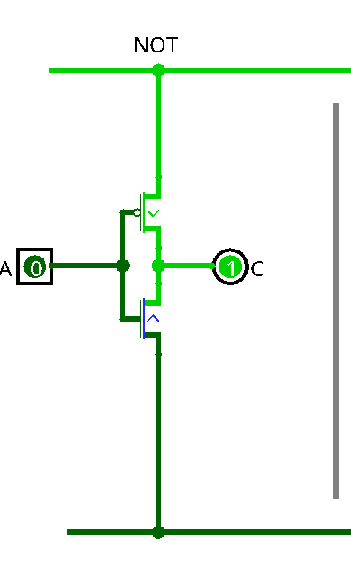
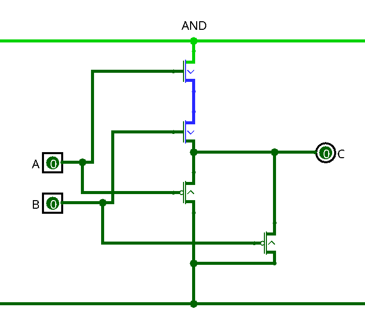
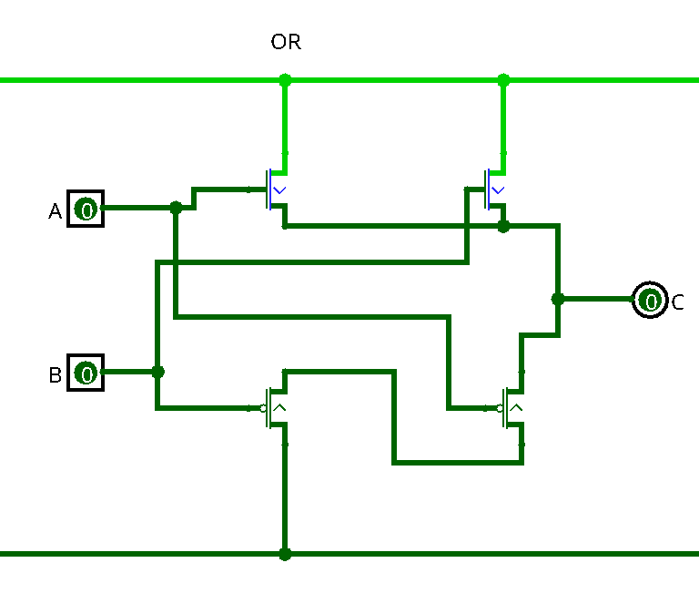
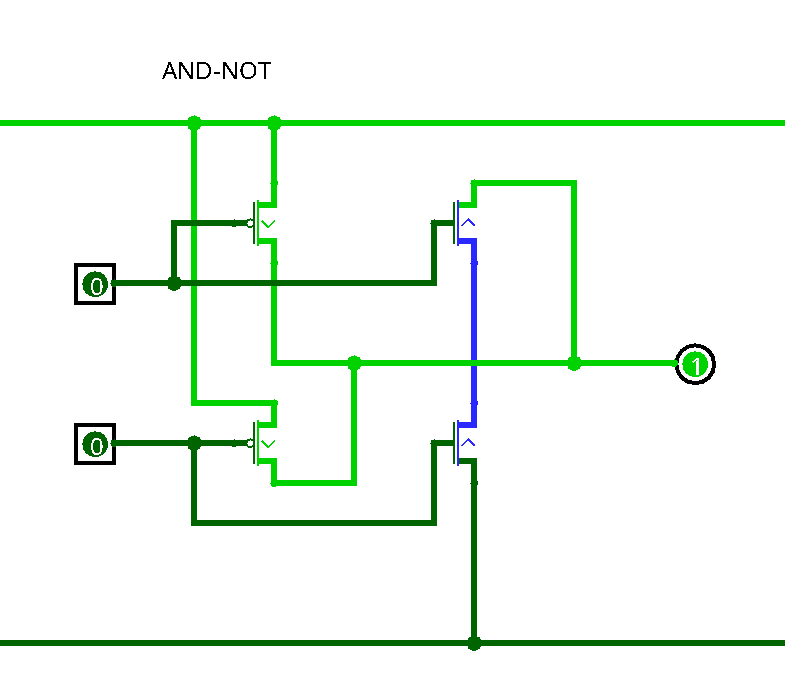
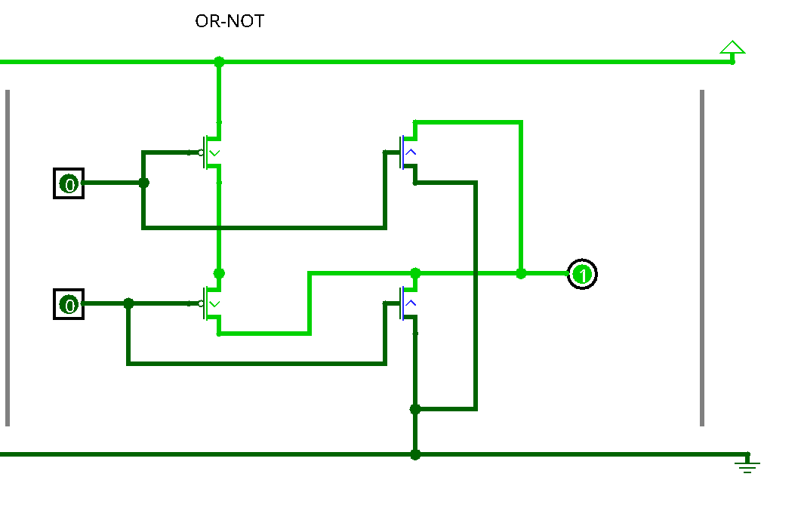

# 
МИНИСТЕРСТВО ЦИФРОВОГО РАЗВИТИЯ СВЯЗИ И МАССОВЫХ КОММУНИКАЦИЙ

## 
Ордена Трудового Красного Знамени Федеральное государственное бюджетное образовательное учреждение высшего образования

## 
«Московский технический университет связи и информатики»

## 
Факультет «Информационные технологии»

## 
Лабораторная работа №1

## 
Создание схем “НЕ, И, ИЛИ, НЕ И, НЕ ИЛИ”

Выполнил: Студент группы

БПИ 2306

Макриденко Адриан

Москва

2023

## 
NOT

НЕ – транзисторы п-типа пропускают питание, если на их затвор подключен 0, а транзисторы н-
типа пропускают, если подключен 1 Таким образом, если от питания будет идти транзистор п-
типа, а от земли будет идти транзистор н-типа, то при переключении значения входа будет
меняться значение выхода на противоположное.

## 
AN
D

И – 1 на выходе будет получаться только при двух единицах на входе, следовательно нужно от
питания последовательно подключить 2 транзистора н-типа, которые будут пропускать питание
при двух единицах на входе. Тогда нули будут во всех остальных случаях, следовательно от земли
нужно подключить параллельно 2 транзистора п-типа, которые пропустят на выход 0 хотя бы при
одном нуле на входе.

## 
OR

ИЛИ – 0 на выходе будет только при двух нулях на входе, следовательно от земли нужно
последовательно подключить 2 транзистора п-типа, которые выведут на выход 0 при двух нулях на
входе. 1 будет во всех остальных случаях, следовательно нужно от питания подключить
параллельно 2 транзистора н-типа, которые выведут 1 хотя бы при одной единице на входе.

## 
AND NOT

НЕ И – 0 на выходе будет только при двух единицах на входе, следовательно нужно от земли
подключить последовательно 2 транзистора н-типа, которые выведут 0 на выход при двух
единицах на входе. 1 тогда будет во всех остальных случаях, следовательно от питания нужно
подключить параллельно 2 транзистора п-типа, которые выведут 1 на выход хотя бы при одном
нуле на входе.

## 
OR NOT

НЕ ИЛИ – 1 на выходе будет только при двух нулях на входе, следовательно нужно от питания
последовательно подключить 2 транзистора п-типа, которые выведут на выход единицу при двух
нулях на входе. Тогда 0 будет во всех остальных случаях, следовательно от земли нужно
параллельно подключить 2 транзистора н-типа, которые выведут 0 хотя бы при одной единице на
входе.
