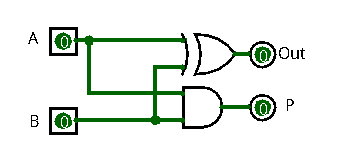
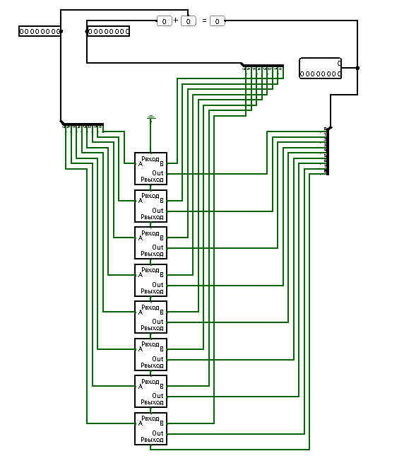
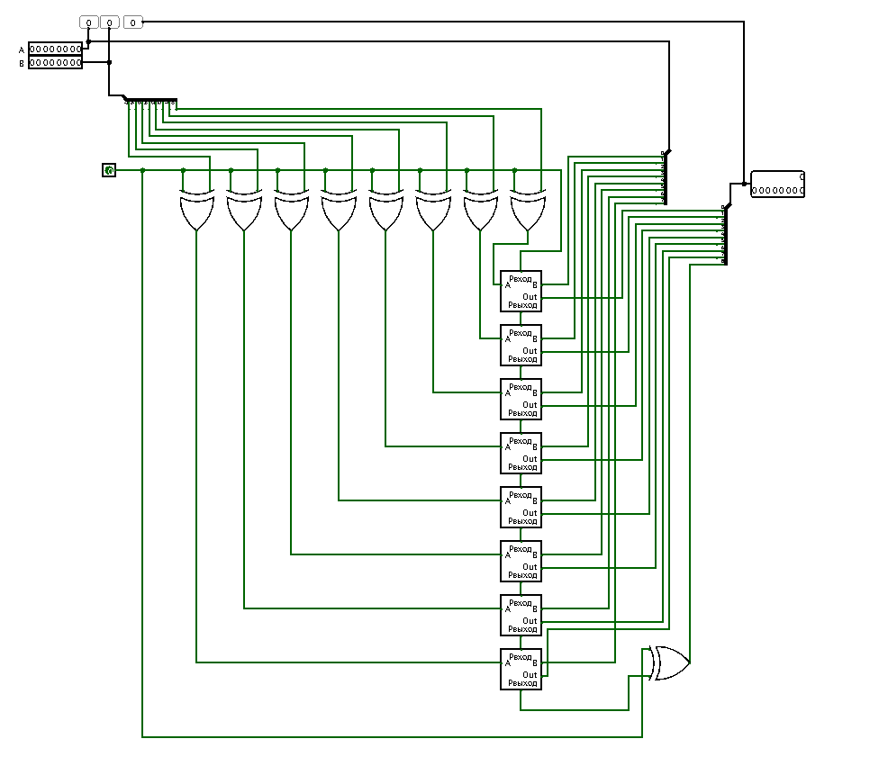
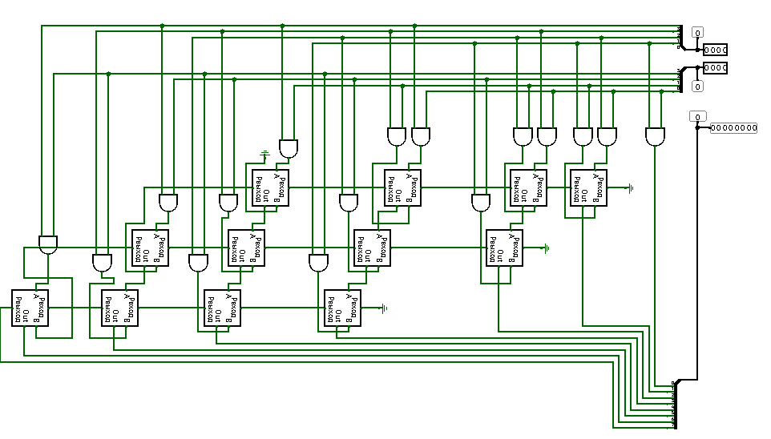

# 
МИНИСТЕРСТВО ЦИФРОВОГО РАЗВИТИЯ СВЯЗИ И МАССОВЫХ КОММУНИКАЦИЙ

## 
Ордена Трудового Красного Знамени Федеральное государственное бюджетное образовательное учреждение высшего образования

## 
«Московский технический университет связи и информатики»

## 
Факультет «Информационные технологии»

## 
Лабораторная работа №2

## 
Создание сумматора с функцией вычитания и умножатора

Выполнил: Студент группы

БПИ 2306

Макриденко Адриан

Москва

2023

## 
Полусумматор

Ставим два элемента: «И» и «Исключающее ИЛИ». При включении
контактов будет выводиться их сумма (0+0 = 0) (0+1 = 01) (1+0 = 01)
Когда на контакте будет две единицы, то ответ будет 11, одна единица
переходит в CO (carry output)

## 
Сумматор

В сумматоре появляется CI (carry in), который принимает сигнал от прошлого
сумматора, тем самым мы получаем полный цикл и можем использовать его
для построения других сумматоров

## 
8-битный сумматор

8 сумматоров, у каждого идет последовательное подключение CO-CI.
Происходит суммирование первых чисел и при переполнении одно число
переходит в другой разряд и суммируется вместе с суммой другого разряда

## 
Вычитатор

При 0 на контакте по середине происходит сложение чисел А и В. Переводя
этот контакт в 1, второе число инвертируется и к нему добавляется 1 и
происходит суммирование. Так же добавлен ввод/вывод знаковым
десятичным и беззнаковым десятичным для понимая какие числа
суммируются или вычитаются

## 
Умножатор

На вход подается 2 4-битных числа. Используя элемент «И», который важен
для умножения 1 и 0 Мы так же используем сумматор для складывания
чисел из разных разрядностей. Последовательное соедениение «и» и
сумматора дает возможность перемножать двоичные четырехбитные числа
